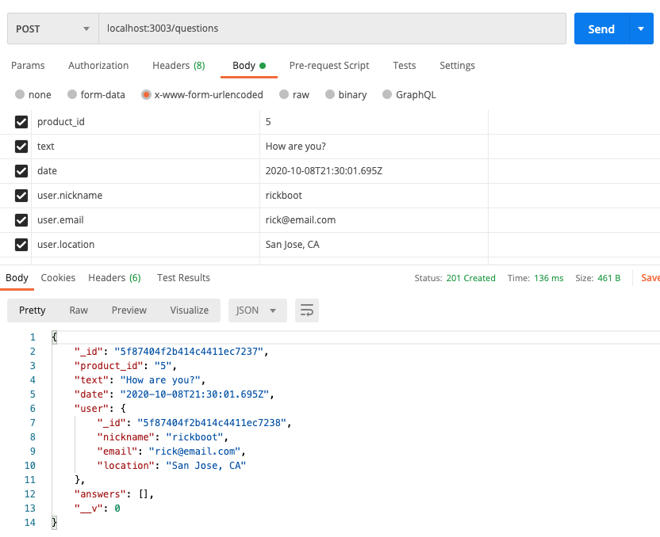
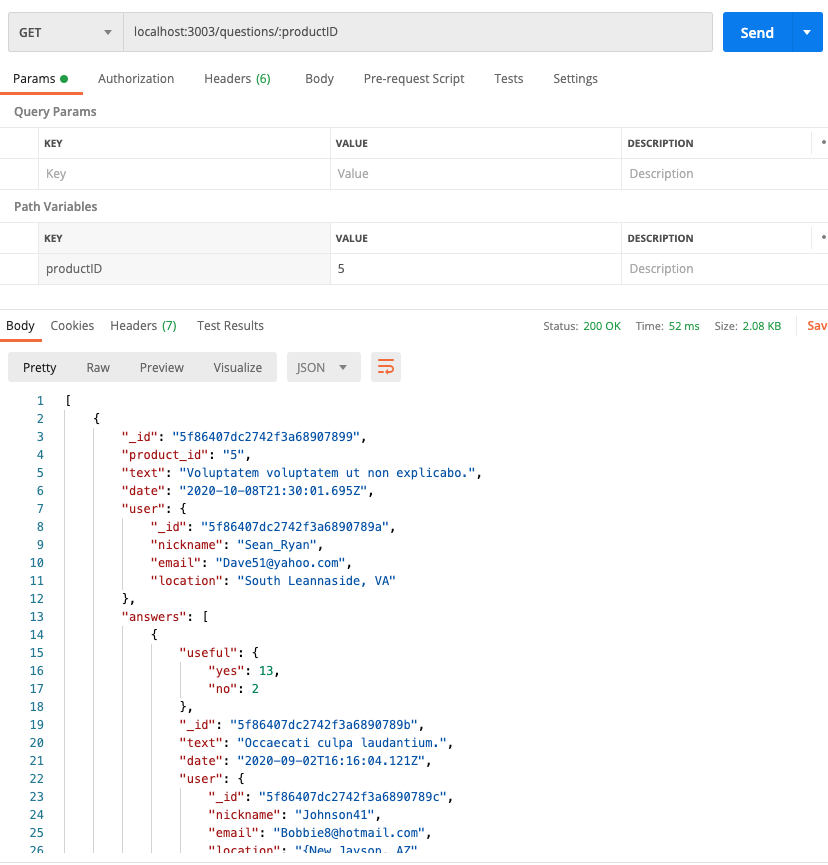
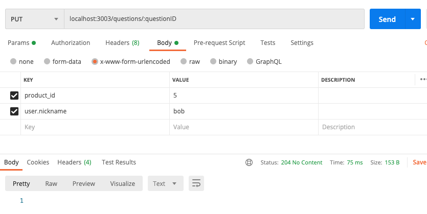

# Phase 1: Scale the Database

## Support CRUD from your API
| intention | request type | request url |
| ----------| :----------: | ----------- |
| Create a new item | POST | `/api/questions` |
| Read questions and answers for specific product ID | GET | `/api/questions/:productID` |
| Update an item for specific question ID | PUT | `/api/questions/:questionID` |
| Delete an item for specific question ID | DELETE | `/api/questions/:questionID`|

<br><br>


## POST question
1. Path Parameters: none
2. Success Status Code: `201`
3. Request Body: Expects JSON with following keys
 ```javascript
  {
      product_id: Number,
      text: String,
      date: Date,
      user: {
          nickname: String,
          email: String,
          location: String
      },
  }
  ```
  4. Returns: Posted question


## GET question and answers associated with Product ID
1. Path Parameters: `productID`, which refers to `product_id` in returned data
2. Success Status Code: `200`
3. Request Body: none
4. Returns:
  ```javascript
  [
      {
          _id: ObjectId(),
          product_id: Number,
          text: String,
          date: Date,
          user: {
              _id: ObjectId(),
              nickname: String,
              email: String,
              location: String
          },
          answers: [
              {
                  useful: {
                      yes: Number,
                      no: Number
                  },
                  _id: ObjectId(),
                  text: String,
                  date: Date,
                  user: {
                      _id: ObjectId(),
                      nickname: String,
                      email: String,
                      location: String
                  }
              }
          ],
      }
  ]
  ```

## PUT question given a Question ID

1. Path Parameters: `questionID`, which refers to `_id` in returned data
2. Success Status Code: `204`
3. Request Body: Expects JSON with following keys
 ```javascript
  {
      product_id: Number,
      text: String,
      date: Date,
      user: {
          nickname: String,
          email: String,
          location: String
      },
  }
  ```
4. Returns: 0 or 1

## DELETE question given a Question ID

1. Path Parameters: `questionID`, which refers to `_id` in database
2. Success Status Code: `204`
3. Request Body: None
4. Returns: 0 or 1


<br>

----
## Proof
1. POST


2. GET


3. PUT


4. DELETE
