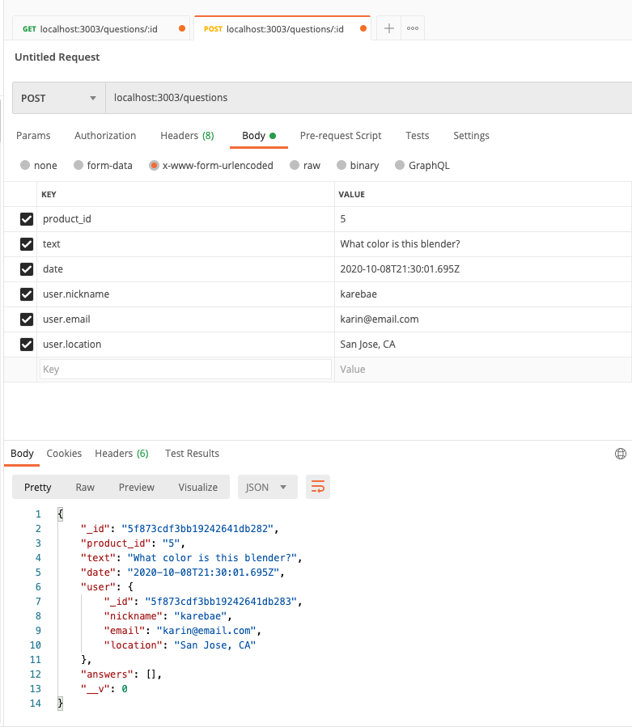

# Phase 1: Scale the Database

## Support CRUD from your API
| intention | request type | request url |
| ----------| :----------: | ----------- |
| create a new item | POST | `/api/questions` |
| read questions and answers for specific `product_id` | GET | `/api/questions/:id` |
| update an item | PUT | `/api/questions/:id` |
| delete an item | DELETE | `/api/questions/:id`|
<br><br>


## POST question
1. Path Parameters: none
2. Success Status Code: `201`
3. Request Body: Expects JSON with following keys
 ```javascript
  [
      {
          "product_id": "5",
          "text": "What color is this blender?", // the actual question being asked
          "date": new Date(),
          "user": {
              nickname: "karebae",
              email: "karin@email.com",
              location: "San Jose, CA"
          },
      }
  ]
  ```
  4. Returns: none



## GET question and answers associated with it
1. Path Parameters: `id`, which refers to `product_id` in returned data
2. Success Status Code: `200`
3. Request body: none
4. Returns:
  ```javascript
  [
      {
          "_id": "5f86407dc2742f3a689078a3",
          "product_id": "5", // path variable is associated with this
          "text": "Nam iste voluptatem at.", // the actual question being asked
          "date": "2019-12-24T13:46:24.878Z",
          "user": {
              "_id": "5f86407dc2742f3a689078a4",
              "nickname": "Travis_Schmitt67",
              "email": "Kathlyn_Hessel@hotmail.com",
              "location": "South Lavadaport, AK"
          },
          "answers": [
              {
                  "useful": {
                      "yes": 1,
                      "no": 0
                  },
                  "_id": "5f86407dc2742f3a689078a5",
                  "text": "Aspernatur facere dolorem atque enim vel est recusandae in tempora.",
                  "date": "2020-07-24T23:32:22.976Z",
                  "user": {
                      "_id": "5f86407dc2742f3a689078a6",
                      "nickname": "Uriel93",
                      "email": "Rozella.Berge88@gmail.com",
                      "location": "{Strosinbury, AK"
                  }
              }
          ],
          "__v": 0
      }
  ]
  ```

## PUT

status: 201

## DELETE


